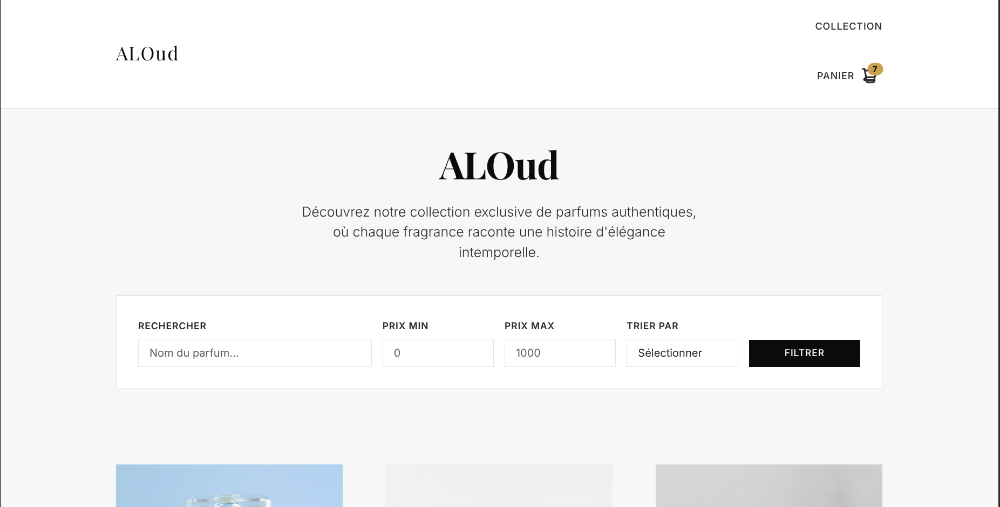
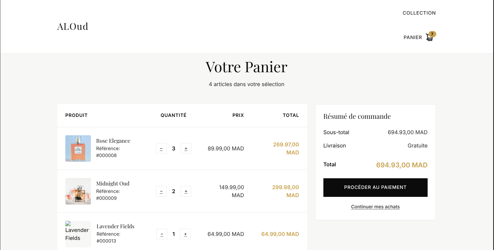

# ALOud

ALOud is a sophisticated perfume and fragrance e-commerce platform built with **ASP.NET Core Razor Pages**, following **MVVM architecture**, using **Entity Framework Core** and **SQL Server**.

## Screenshots

## Features

-   Perfume and fragrance catalog
-   Product details page with fragrance notes
-   Shopping cart with Redis caching
-   Search & filters by categories (Men's, Women's, Unisex)
-   Modern UI (Bootstrap 5)
-   SQL Server database with Entity Framework Core
-   Redis caching for improved performance

## Tech Stack

-   ASP.NET Core (.NET 8)
-   Razor Pages (MVVM)
-   Entity Framework Core
-   SQL Server
-   Redis Cache
-   Bootstrap 5

## How to run

1. Clone the repository
2. Restore missing services: `docker compose up -d`
3. Configure environment variables:
    - Copy `.env.example` to `.env`
    - Fill in `DB_CONNECTION_STRING` (Password must match `docker-compose.yml`)
    - Fill in `SMTP_USER` and `SMTP_PASSWORD` for email features
    - Fill in `GEMINI_API_KEY` for AI features
4. Run database migrations: `dotnet ef database update`
5. Start the project: `make dev` (or `dotnet run`)

## Database Structure

-   **Products**: Perfume products with categories, prices, and images
-   **Categories**: Men's Fragrances, Women's Fragrances, Unisex Fragrances
-   **Cart**: Redis-based shopping cart system

---

ALOud - Where every scent tells a story. A modern perfume e-commerce platform built for fragrance enthusiasts.
